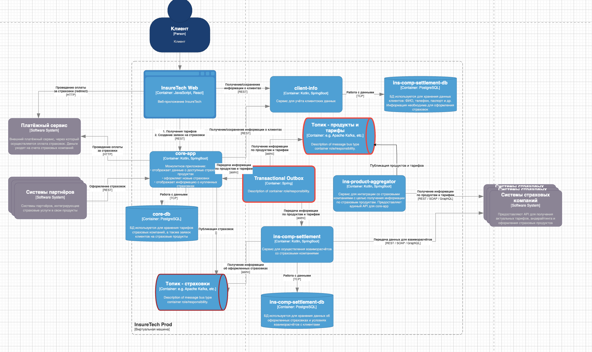

# Проблемы и риски

>Сервисы core-app и ins-comp-settlement получают данные о доступных продуктах через REST API сервиса ins-product-aggregator. В момент вызова он:
>- запрашивает информацию из всех страховых компаний (сейчас их пять),
>- агрегирует её в единый список,
>- возвращает этот список в рамках того же синхронного запроса.

Синхронное взаимодействие приводит к торможению core-app и ins-comp-settlement на время ожидания ответа от ins-product-aggregator

>Дополнительно сервис ins-comp-settlement раз в сутки осуществляет запрос в core-app по REST API для получения всех оформленных за день страховок. Эти данные он использует. 

Синхронное взаимодействие приводит к торможению ins-comp-settlement на время ожидания ответа от core-app 

>Команда решила хранить локальные реплики данных о продуктах и тарифах в сервисах core-app и ins-comp-settlement.

Состояние данных о продуктах в локальных  репликах  будут  временно рассинхронизированы из-за разных моментов  выполнения запросов на их актуализацию

При росте нагрузки задержки возрастут, вероятность длительной рассинхронизации данных увеличится, возможны падения сервисов из-за перегрузки ресурсов

# Решение

1. Перейти на Event driven архитектуру путем организации взаимодействия c ins-product-aggregator (который будет публиковать список по страховым компаниям) и между core-app (который будет публиковать оформленные страховки) и  ins-comp-settlement по шаблону Pub-Sub
2. Применить шаблон Transactional Outbox для раздачи данных о страховых компаниях сервисам core-app и ins-comp-settlement во избежание рассогласования данных в репликах

