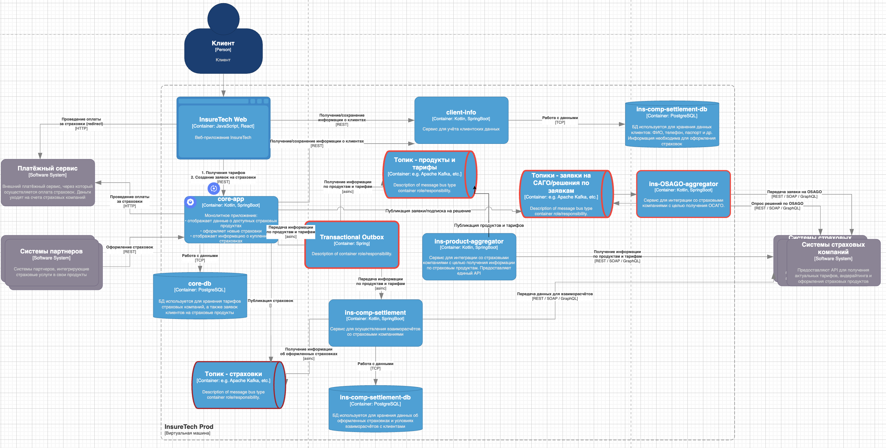

# Реализация osago-aggregator
1. Собсвенное хранилище сервису osago-aggregator не нужно, так как он поштучно обрабатывает заявки которые персистируются в Kafka
2. API для core-app он предоставляет событийное, на основе топиков Kafka, которая является средством интеграции между osago-aggregator и core-app
API для веб-приложения в core-app должно быть оснащено API Gateway для масштабирования маршрутизации и балансировки запросов, интенсивность которых возрастёт, там же должен быть включен механизм Circuit Breaker, для защиты от краткосрочных перегрузок. API core-app может оставаться REST, при росте нагрузки применить автомасштабирование на уровне оркестратора контейнеров

